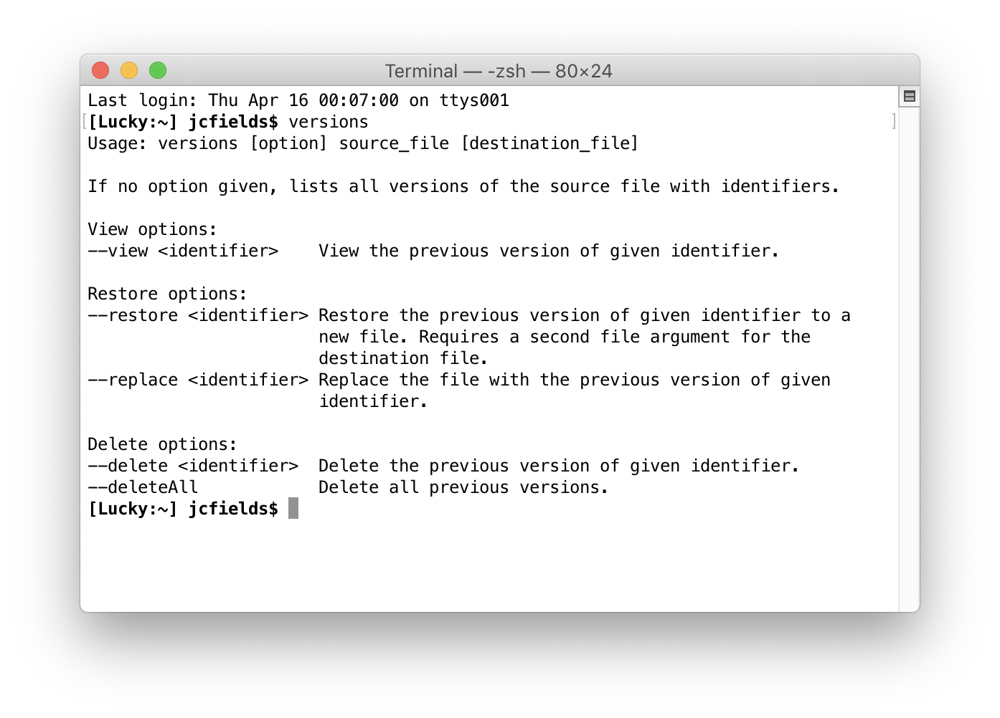

# versions

A command-line utility for accessing the file versioning system of Mac OS. Written in Objective-C. Requires Mac OS 10.12 (Sierra) or higher.

The Versions feature was added in Lion, along with auto-saving, as part of a broad overhaul of the operating system's document model. It's similar to Time Machine in that it saves previous versions of files, but it works separately from it (and without it). This utility provides a way to view, restore, and delete old versions from the command line.

## Releases

Binary versions are available on the [Releases](https://github.com/jcfieldsdev/versions/releases) page.

Binaries are self-signed but not notarized, so Mac OS 10.15 (Catalina) and higher display an error upon launching it. [Right-click the application icon and select "Open"](https://support.apple.com/guide/mac-help/open-an-app-by-overriding-security-settings-mh40617/mac) to enable the option to bypass this security warning.

## Guide

Usage: `versions [option] source_file [destination_file]`

If called with no option, lists all versions of the source file with identifiers.

The second argument for the destination file is only needed when using the `--restore` option.

| Option | Flag | Function |
| -- | -- | -- |
| `--help` | `-h` | Shows list of options. |
| `--view <identifier>` | `-v <id>` | Views the previous version with the given identifier. |
| `--restore <identifier>` | `-r <id>` | Restores the previous version with the given identifier to a new file. Requires a second file argument for the destination file. |
| `--replace <identifier>` | `-p <id>` | Replaces the file with the previous version with the given identifier. |
| `--delete <identifier>` | `-d <id>` | Deletes the previous version with the given identifier. |
| `--deleteAll` | `-x` | Deletes all previous versions of the file. |

You can use either the short flag or the long option version of each option (whichever you prefer). Only one option is accepted for a single command; any additional options are ignored.

The current version of the file always has the identifier 0 and cannot be used as an value for any of the options.

## Examples

### Listing previous versions

To look at all the previous versions of an example file "columns.js":

    $ versions columns.js
    [  2] Apr 7, 2020 at 10:29:48 PM     columns.js
    [  1] Apr 7, 2020 at 10:35:22 PM     columns.js
    [  0] Apr 7, 2020 at 10:49:09 PM     columns.js

The program prints a table of previous versions. For each version, it shows an identifier number, the date and time the version was saved, and the file name (which may have changed if the file was renamed). Identifier numbers count down, so 0 is always the most recent (current) version and larger numbers are older.

### Viewing previous versions

To view a previous version, use the `--view` option:

    $ versions --view 1 columns.js

This prints the contents of the file to the stdout stream, which you can view directly from the Terminal or combine with other Unix utilities. For example, you can pipe it into `less` for a scrollable view:

    $ versions --view 1 columns.js | less

Or open it as a temporary file in your default text editor:

    $ versions --view 1 columns.js | open -ft

Or copy its contents to the clipboard:

    $ versions --view 1 columns.js | pbcopy

Or combine it with `diff` to show the differences with the current version of the file:

    $ versions --view 1 columns.js | diff columns.js -

### Restoring previous versions

If we want to restore a previous version, we can use the `--restore` option to save it to a new file name:

    $ versions --restore 1 columns.js columns-old.js
    Successfully restored version 1 of columns.js to columns-old.js.

The provided number corresponds to the version we want to restore. If no number is provided, an error message is displayed. Restoring a file with this option doesn't change the version history of the original file. If there's already a file with the destination name, it will be overwritten.

We can also restore a previous version by replacing the latest version of the file (instead of saving it to another file). To do this, we use the `--replace` option:

    $ versions --replace 1 columns.js
    Successfully restored version 1 of columns.js.

Because we're replacing the original file, we don't need to provide a second file name. We do need to provide a version number or an error is displayed. Restoring a file with this option adds a new version to the history of the file but doesn't remove any of the previous versions.

### Deleting previous versions

Deleting versions works the same way. To delete a specific version, use the `--delete` option:

    $ versions --delete 1 columns.js
    Successfully deleted version 1 of columns.js.

Note that deleting a version causes the other versions to be renumbered, so be careful issuing another command after a delete.

To delete all versions, use the `--deleteAll` option:

    $ versions --deleteAll columns.js
    Successfully deleted all previous versions of columns.js.

Because we're deleting all previous versions, we don't need to provide an identifier. The current version of the file will not be affected by this command. Make sure you really want to delete the file history since this command is irreversible.

## Acknowledgments

Uses [GBCli](https://github.com/tomaz/GBCli) library by [Tomaz Kragelj](https://github.com/tomaz) for parsing command-line arguments.

Uses [replay icon](https://www.flaticon.com/free-icon/replay_1142347) by [Freepik](https://www.freepik.com/).

## Authors

- J.C. Fields <jcfields@jcfields.dev>

## License

- [GNU General Public License, version 3](https://opensource.org/licenses/GPL-3.0)

## See also

- [Restore](https://github.com/jcfieldsdev/restore)—A GUI application that does the same thing.
